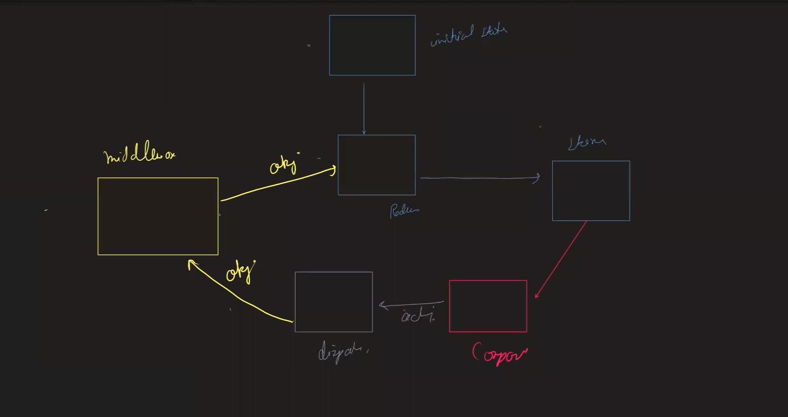
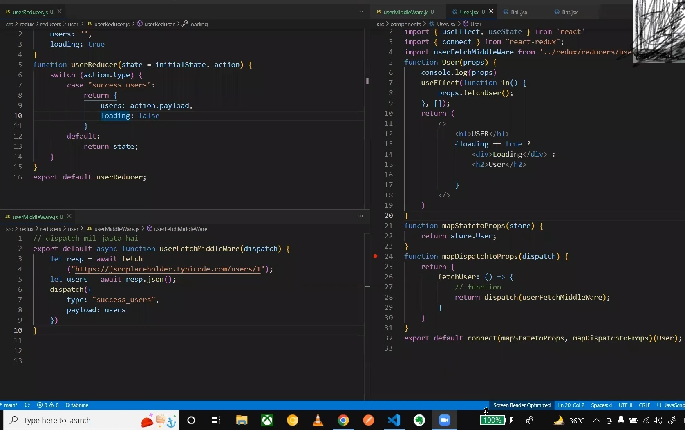
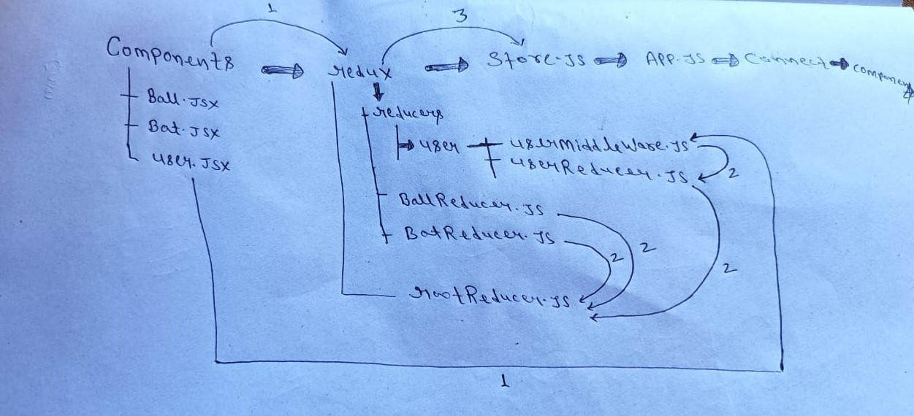

## First solve with "useState" then "useReducer" then "Reducer"
------------------
### steps :
##### 1- counterBallWithUseState
##### 2- counterBallWithUseReducer
##### 3- sellBuyBatUseState
##### 4- sellBuyBatUseReducer
##### 5- In Redux -> reduxwithball
##### 6- In Redux -> reduxwithbat
##### 7- In Redux -> multiple -> multicomponents
##### 8- In Redux -> async-data -> waited-data-by-use-effect
##### 9- In Redux -> async-data -> handle-async-data-with-middleware-in-redux

----------------------------------------
---------------------------------------
---------------------------------------

## compair between "useState" & "useReducer" Hooks

### useState :

      const [state,setState] = useState("initialState")
-----------------------

      import React,{useState} from 'react'

      function Ball() {
        const [balls,setBalls] = useState(10)

        let  increment = ()=>{
                setCounter(balls + 1)
         }

        let  decrement = ()=>{
            if(balls>0)
                setCounter(balls -1)
        }

        return (
        
            <>
            <h1>balls</h1>
            <h1>no of balls:{balls}</h1>
            <button onClick={increment}>+</button>
            <button onClick={decrement}>-</button>
            </>
        )
        }

        export default Ball


### useReducer :
   
     const [state, dispatch] = useReducer(reducer, initialState);


- (reducer, initialState) :

     - initialState => balls:10
    
    - useReducer , " initial state " ke sath sath " reducer " function bhi leta hai.
    - reducer() function as a parameter "state" & "action" leta hai.
         
         - reducer , state change karta hai.
         - dispatch ek fun hai , jo "action" bhejta hai "reducer" ke pas taki wo "state" ko change kare
      
           
           
               function reducer(state,action){
                 switch(action.type){
                     case 'increment':
                         return state+1;

                     case 'decrement':
                         return state-1; 
                    
                     default:
                         console.log("wrong type") ;   
                }
            }

    

- [state, dispatch] :
   
   - increment , decrement => enn dono k liye useReducer ek common function dega "dispatch()" nam se.
   - dispatch me value pass karte hai with the help of "payload"
   - dispatch("action" as a obj) = dispatch({...}) 
   
      -  dispatch ek fun hai , jo "action" bhejta hai "reducer" ke pas taki wo "state" ko change kare
        
   
   
                   return (
                      <>
                        <h1>balls</h1>
                        <h1>no of balls:{state}</h1>
                        <button onClick={()=>{
                            dispatch({type:'increment'})
                        }}>+</button>
                        <button onClick={()=>{
                            dispatch({type:'decrement'})
                        }}>-</button>
                      </>
                  )
               
   ----------            
   - get Input :        
               
                <input type={'number'}  value={state.value} 
                    onChange={(e)=>{
                        let typeValue = e.target.value; 
                        dispatch({ type:'set_value' , payload:typeValue }) // dispatch me value pass kiye with the help of "payload"
                        }}   
                />

                 


        


- eg-1 : 
```js
            import React,{useReducer} from 'react'

            function reducer(state,action){
                switch(action.type){
                    case 'increment':
                        return state+1;

                    case 'decrement':
                        return state-1; 
                    
                    default:
                        console.log("wrong type") ;   
                }
            }


            function Ball() {
                
               const [state,dispatch] = useReducer(reducer,10)

                return (
                    <>
                    <h1>balls</h1>
                    <h1>no of balls:{state}</h1>
                    <button onClick={()=>{
                        dispatch({type:'increment'})
                    }}>+</button>
                    <button onClick={()=>{
                        dispatch({type:'decrement'})
                    }}>-</button>
                  </>
                )
            }

            export default Ball
```
- eg-2 :
```js
        const initialState = {count: 0};

        function reducer(state, action) {
            switch (action.type) {
                case 'increment':
                return {count: state.count + 1};
                case 'decrement':
                return {count: state.count - 1};
                default:
                throw new Error();
            }
        }

        function Counter() {
            const [state, dispatch] = useReducer(reducer, initialState);
            return (
                <>
                Count: {state.count}
                <button onClick={() => dispatch({type: 'decrement'})}>-</button>
                <button onClick={() => dispatch({type: 'increment'})}>+</button>
                </>
            );
        }

```


## In sellBuyBatUseReducer :

```js   
       //reducer function Hints :

        function reducer(state,action){  
               
                switch(action.type){
                      
                      case 'sell_bat':
                           break;
                       
                      case 'buy_bat':
                           break;
                          
                      case 'set_value':
                                             
                           break;                          
                }
        }


```

```js

       import React,{useReducer} from 'react'
        
        let initialState = {
            bat:10,
            value:''   // tosell ko as a "value" liye h 
        }

        function reducer(state,action){   // dispatch related to action , dispatch passes obj , in obj -> action form
            switch(action.type){
                case 'sell_bat':
                    if(state.bat - state.value <0){  // handle krr rha ki buy karne prr -ve me na jaye 
                        return {
                            ...state,                // state me initialState pass hua h
                            value:''
                        }
                    }
                    return{
                        bat:state.bat - state.value,
                        value:''                      // input me jo value type kiye h as a "tosell" usseee-> , input se hataye h 
                    }
                break;
                
                case 'buy_bat':
                    return{
                        bat:state.bat + Number(state.value),
                        value:''
                    }
                break;

                case 'set_value':
                    return{
                        bat:state.bat,
                        value:action.payload     // jo dispatch se object pass karte h use "action" bolte h 
                    }                           //  dispatch se  [type='set_value'] & [payload] pass huaa h toh action se hi access karte h ..  i.e action.payload
                break;                          
            }
        }


        function Bat() {
        const [state,dispatch] = useReducer(reducer,initialState)

        return (
            <>
            <h1>Bat</h1>
            <h1>no of bats:{state.bat}</h1> 
            <input type={'number'}  value={state.value} 
                onChange={(e)=>{
                    let typeValue = e.target.value; 
                    dispatch({ type:'set_value' , payload:typeValue }) // dispatch me value pass kiye with the help of "payload"
                }}                                                    // payload se data pass krr rhe h , matlab action form ho rha 
            />
            <button onClick={()=>{dispatch({type:'sell_bat'})}}>sell</button>
            <button onClick={()=>{dispatch({type:'buy_bat'})}}>buy</button>
            </>
        )
        }

        export default Bat

```


# Redux :

#### Do you learn to Redux after doing these four things.( agar aap ye char chije krr lete ho toh aap redux sikh jate ho ):
- state change
- user-Input ... 
   - payload=> x amount se change karna
     
     -  example of Bat components => reduxwithbat
- multiple type of data ... 
   - kahi "theme" wala hai, kahi "login" wala hai toh usko store kaise karegen
- some req / Db query  [async task k sath]
--------- 

#### npm i redux react-redux
- Reducer
- initialState
- dispatch
- action
- type
- payload


#### Reducer :
- It contains all the state manipulation logic.
  [state change karta hai]

#### initialState :
- your state , when your app initially renders.

#### dispatch :
- It is a function that is used to pass "action" object to reducer.

#### action :
- It is an object send by dispatch to reducer function.
- It contain two properties :
   
   -  type 
   -  payload : ( dispatch me "value" pass karte hai with the help of payload. )
------  
 

-------------
### Redux => reduxwithball :
--------------
- esme dispatch ko samil nhi kiye hai :
  


- initialState => reducer => store => connect [ To connect your store(mapStateToProps) with a components(Ball) ]

- provider : ( In App.js me )
  
  - "redux" ko apane "app." se connect kiya
  - ess provider k through hmm apni "app" ko "redux" ke sath connect kar sakte hai.
   - install & import  react-redux for Provider 
       - npm i react-redux
       - import { Provider } from 'react-redux';  
   - store :
  
     - ess provider ko pata hi nhi hamara "state" kaha hai, kaun se "store" me hai ,
     - eske pas koi information nahi hai , toh information k liye hme "store" ko import karna pda.
     - ess "store" ko as a "props" pass kar degen "Provider" ko 
  
         
            import { Provider } from 'react-redux'; 
            import store from './store';

            
            <Provider store={store}>
             <Ball/>
            </Provider>


- connect :
    
  - to connect your "store" with a "components".
  - agar ye ball components ko store se bat karani hai, toh hamare pas ek function hota hai "connect"
  - export default connect(mapStateToProps)(Ball);
 
  -  "store"  -> mapsstatetoprops ,     "components" -> Ball
     
     
           
           function Ball(props) {
                console.log(props)
                return (<>
                    <h1>Balls</h1>
                    <h2>No of Balls:{props.balls}</h2>
                    <button>+</button>
                    <button>-</button>
                </>
                )
            }


            
            
            // to get your state-variable from redux store , (store dispatch function bhi provide karta h) 
           
            const mapStateToProps = (store) => {   
                return store;  // this fun return state-variable as a props in our Ball component.
                        
            }


            export default connect(mapStateToProps, mapDispatchtoProps)(Ball);
      
     


## Imp


- initialState => reducer => store => connect => components => dispatch => reducer
#### initialState :
- your state , when your app initially renders.
- obj k form me rahti hai
- state ki default value aati h esme
#### Reducer :
- It contains all the state manipulation logic.
  [state change karta hai]
- jo bhi "state" change hogi wo aapke reducer me ja kar hogi  

#### store : 
- 
#### connect :
- To connect your "store" with a "components"
#### components :
-

#### dispatch :
- It is a function that is used to pass "action" object to reducer.
- dispatch ek fun hai , jo action bhejta hai "reducer" ke pas taki wo "state" ko change kare
-  dispatch(action as obj) => action => (1) type  (2) payload
```js
 dispatch({
     type: ...... , 
     payload : value yha aayega
 })
```
#### action :
- It is an object send by dispatch to reducer function.
- aapke "state" change karne me help karta hai
- It contain two properties :
   
   -  type 
   -  payload : ( dispatch me "value" pass karte hai with the help of payload. )
------  
 
- Ball.js
```js
    import React from 'react'
    import { connect } from "react-redux";

    function Ball(props) {    // esme store & dispatch as a "props" pass huye h 
        console.log(props)
        return (<>
            <h1>Balls</h1>
            <h2>No of Balls:{props.balls}</h2>
            <button
                onClick={props.buyBall} 
            >+</button>
            <button
                onClick={props.sellBall}

            >-</button>
        </>
        )
    }


    // to get your state variable from redux store , (store dispatch function bhi provide karta h) 
    const mapStateToProps = (store) => {   
        return store;  // this fun return state-variable as a props in our Ball fun.
                
    }


    // dispatcher solve - fun pass[setbal,buyball] as a props 
    const mapDispatchtoProps = (dispatch) => {      // return function as props
        return {                         //HINT ::=> sellBall:dispatch(action as obj)          
            sellBall: () => {           //HINT ::=> sellBall:dispatch({})   -> [click karne prr call ho] ->  sellBall:()=>{dispatch({})} 
                dispatch({                     
                    type: "decrement"
                })
            },
            buyBall: () => {
                dispatch({
                    type: "increment"
                })
            }
        }
    }


    // to give access to the component to two things
    //  first store  -> mapsstatetoprops
    // second  -> dispatch -> mapdispatchtoprops

    export default connect(mapStateToProps, mapDispatchtoProps)(Ball);

    /*_________________OR_________________________*/


    // const connectdWIthpropsFns = connect(mapStateToProps, mapDispatchtoProps)
    // const connectedWithBall = connectdWIthpropsFns(Ball);
    // export default connectedWithBall;

```
- connect :
    
  - to connect your "store" with a "components".
  - agar ye ball components ko store se bat karani hai, toh hamare pas ek function hota hai "connect"
  - export default connect(dispatch,store)(components)
  - export default connect(mapStateToProps, mapDispatchtoProps)(Ball);
  - to give access to the component to two things:
      
      - first -> "store"  -> mapsstatetoprops
      - second  -> "dispatch" -> mapdispatchtoprops
         - -----------------------------------------------------
     - first -> "store"  -> mapsstatetoprops
     
     
            function Ball(props) {
                console.log(props)
                return (<>
                    <h1>Balls</h1>
                    <h2>No of Balls:{props.balls}</h2>
                    <button>+</button>
                    <button>-</button>
                </>
                )
            }

            
            
            // to get your state-variable from redux store , (store dispatch function bhi provide karta h) 
           
            const mapStateToProps = (store) => {   
                return store;  // this fun return state-variable as a props in our Ball components.
                        
            }


            
      
     - second  -> "dispatch" -> mapdispatchtoprops

            // dispatcher solve - fun pass[setbal,buyball] as a props 
          
            const mapDispatchtoProps = (dispatch) => {      // return function as props
                return {                         //HINT ::=> sellBall:dispatch("action" as object lega)           
                    sellBall: () => {           //HINT ::=> sellBall:dispatch({})   -> [click karne prr call ho] ->  sellBall:()=>{dispatch({})} 
                        dispatch({                     
                            type: "decrement"
                        })
                    },
                    buyBall: () => {
                        dispatch({
                            type: "increment"
                        })
                    }
                }
            }

---------------
## multiple type of data handle with redux :
----------------------
#### redux folder => [reducers folder -> ballReducer , batReducer]  , rootReducer => store => app.js[Provider] => connect => components folder -> Ball.jsx , Bat.jsx => dispatch => [redux folder -> reducers,rootReducer]
#### redux folder :=>
- reducers -> 
  - ballReducer 
     ```js

        let initialState = {
            balls: 10
        }

        // when state is not passed -> initial state -> 10
        function ballReducer(state = initialState, action) {
            switch (action.type) {
                case "increment":
                    return {
                        balls: state.balls + 1
                    };
                    break;
                case "decrement":
                    if(state.balls>0)
                    return {
                        balls: state.balls - 1
                    };
                    break;
                default:
                    return state;
            }
        }

        export default ballReducer;

     ```

  -  batReducer
     ```js
        let initialState = {
            bat: 10,
            value: ""
        }

        function batReducer(state = initialState, action) {
            switch (action.type) {
                case "sell_bat":
                    if (state.bat - state.value < 0) {
                        return {
                            ...state,
                            value: ""
                        }
                    } else {
                        return {
                            bat: state.bat - state.value,
                            value: ""
                        }
                    }
                case "buy_bat":
                    return {
                        bat: state.bat + Number(state.value),
                        value: ""
                    }
                case "set_value":
                    return {
                        bat: state.bat,
                        value: action.payload
                    }
                default:
                    return state
            }
        }
        export default batReducer;
    ```
- rootReducer : IMP
    
    ```js
        import { combineReducers } from "redux";
        import ballReducer from "./reducers/ballReducer"
        import batReducer from "./reducers/batReducer"

        const rootReducer = combineReducers({
            Ball: ballReducer,
            Bat: batReducer,
        });
        export default rootReducer;

    ```
#### store :
  ```js
        import { createStore } from "redux";
        import rootReducer from "./redux/rootReducer";  //esse ballReducer,batReducer dono import huaa h from rootReducer.js
        const store = createStore(rootReducer);

        export default store;

  ```

#### App.js  
  ```js
    import './App.css';
    import Ball from './components/Ball';
    import Bat from './components/Bat';
    import { Provider } from 'react-redux';   //install react-redux -> npm i react-redux for Provider
    import store from './store';

    function App() {
    return (
    
    <>
    <Provider store={store}>
        <Ball/>
        <Bat/>
    </Provider>
    
    </>
    );
    }

    export default App;

  ```

  #### components folder :
- ball.jsx 
  ```js
    import React from 'react'
    import { connect } from "react-redux";

    function Ball(props) {
        console.log(props)
        return (<>
            <h1>Balls</h1>
            <h2>No of Balls:{props.balls}</h2>
            <button
                onClick={props.buyBall} 
            >+</button>
            <button
                onClick={props.sellBall}

            >-</button>
        </>
        )
    }


    // to get your state variable from redux store , (dispatch function bhi provide karta h) 
    // this fun return state...variable as a props in our Ball fun.
    const mapStateToProps = (store) => {   // return state-variable as props
        return store.Ball;                       
    }


    // dispatcher solve - fun pass[setbal,buyball] as a props 
    const mapDispatchtoProps = (dispatch) => {      // return function as props
        return {                                   
            sellBall: () => {           //HINT ::=> sellBall:dispatch({})   -> [click karne prr call ho] ->  sellBall:()=>{dispatch({})} 
                dispatch({                     
                    type: "decrement"
                })
            },
            buyBall: () => {
                dispatch({
                    type: "increment"
                })
            }
        }
    }


    // to give access to the component to two things
    //  first store  -> mapsstatetoprops
    // second  -> dispatch -> mapdispatchtoprops

    export default connect(mapStateToProps, mapDispatchtoProps)(Ball);

    /*_________________OR_________________________*/


    // const connectdWIthpropsFns = connect(mapStateToProps, mapDispatchtoProps)
    // const connectedWithBall = connectdWIthpropsFns(Ball);
    // export default connectedWithBall;

  ``` 

-  bat.jsx
  ```js
    import React from 'react'
    import { connect } from "react-redux";


    function Bat(props) {
        console.log();
        return (
            <>
                <h1>Bat</h1>
                <h2>No of Bat:{props.bat}</h2>
                <input type="number" value={props.value}
                    onChange={(e) => {
                        let value = e.target.value;
                        props.setValue(value);
                    }} />
                <button
                    onClick={props.sellBat}
                >Sell</button>
                <button
                    onClick={props.buyBat}
                >Buy</button>
            </>
        )
    }


    const mapStateToProps = (store) => {
        return store.Bat;
    }


    const mapDispatchtoProps = (dispatch) => {
        return {
            sellBat: () => {
                
                dispatch({ type: "sell_bat" })

            },
            buyBat: () => {
            
                dispatch({ type: "buy_bat" })

            },
            setValue: (value) => {
                dispatch({
                    type: "set_value",
                    payload: value
                })
            }
        }

    }


    export default connect(mapStateToProps,mapDispatchtoProps)(Bat);

    // const connectdWIthpropsFns = connect(mapStateToProps, mapDispatchtoProps);
    // const connectedWithBat = connectdWIthpropsFns(Bat);
    // export default connectedWithBat;

  ```
-----------------------
## asynchronous-task with redux : 
------------------
- initialState --> Reducer => store => connect => components => dispatch => middleWare => reducer
- ** asynchronous-task k liye ** # user.js => userMiddleWare.js => userReducer.js => store.js => App.js => connect => user.js
 





```js
user.js
=========

import React from 'react'
import { useEffect } from 'react'
import { connect } from "react-redux";
import userFetchMiddleWare from '../redux/reducers/user/userMiddleWare';
function User(props) {
    console.log(props);
    useEffect(function fn() { // life-time m ek bar chalega
        props.fetchUser();   // esko dispatch call karega
    }, []);
    return (
        <>
            <h1>USER</h1>
            {props.loading == true ?
                <div>Loading</div> :
                // console.log(props)
                <h2>{props.users.name}</h2>

            }
        </>
    )
}


function mapStatetoProps(store) {
    return store.User;              // rootUser.js se User aaya h , toh "store.Ball" means store se Ball ka data access kiye  
}


function mapDispatchtoProps(dispatch) {
    return {
        fetchUser: () => {
            // function
            return dispatch(userFetchMiddleWare);    // ess dispatch se "fun/obj" kuchh bhi pass kare MiddleWare k pas jayega wha handle hoga phir wha se MiddleWare ka dispatch reducer k pass bhej dega
        }                                            // userFetchMiddleware fun middle ware hai async-data ko handle karne k liye
    }
}
export default connect(mapStatetoProps, mapDispatchtoProps)(User);


```

```js
userMiddleWare.js
==================

// middleware fun banate hai "async-data" ko handle karne k liye
// dispatch mil jaata hai middleware ko
// ye middleware fun hi dispatch marega , ye dispatch bhej diya Reducer ko 
export default async function userFetchMiddleWare(dispatch) {
    let resp = await fetch("https://jsonplaceholder.typicode.com/users/1"); // fetch hua
   
    let users = await resp.json(); // data aya => jo "user data" aaya use dispatch me pass krr diya
    
    dispatch({                     // dispatch hua , abb ja ke check hoga reducer me
        type: "success_users",
        payload: users
    })
}

```

```js
userReducer.js
===============


let initialState = {
    users: "",
    loading: true
}
function userReducer(state = initialState, action) {
    switch (action.type) {
        case "success_users":
            return {
                users: action.payload,
                loading: false
            }
        default:
            return state;
    }
}
export default userReducer;

```

```js
store.js
=========

// npm i redux react-redux

import { createStore ,applyMiddleware} from "redux";
// npm i redux-thunk
import thunk from "redux-thunk";
import rootReducer from "./redux/rootReducer";  //esse ballReducer,batReducer dono import huaa h from rootReducer.js
const store = createStore(rootReducer,applyMiddleware(thunk));

export default store;

```

```js
App.js
=======

import './App.css';
import Ball from './components/Ball';
import Bat from './components/Bat';
import { Provider } from 'react-redux';   //install react-redux -> npm i react-redux for Provider
import store from './store';
import User from "./components/User";

function App() {
  return (
   
   <>
   <Provider store={store}>
       <Ball/>
       <Bat/>
       <User/>
   </Provider>
   
   </>
  );
}

export default App;


```

----------------------
## with asynchronous-task + multiple type of data in Rdux :
--------------------


- initialState --> Reducer => store => connect => components => middleWare => dispatch => Reducer 
- [components --> user.jsx] => middleWare => dispatch => Reducer => store => connect => components 

- components --> user.jsx
```js
user.js
=========

import React from 'react'
import { useEffect } from 'react'
import { connect } from "react-redux";
import userFetchMiddleWare from '../redux/reducers/user/userMiddleWare';
function User(props) {
    console.log(props);
    useEffect(function fn() { // life-time m ek bar chalega
        props.fetchUser();   // esko dispatch call karega
    }, []);
    return (
        <>
            <h1>USER</h1>
            {props.loading == true ?
                <div>Loading</div> :
                // console.log(props)
                <h2>{props.users.name}</h2>

            }
        </>
    )
}


function mapStatetoProps(store) {
    return store.User;              // rootUser.js se User aaya h , toh "store.Ball" means store se Ball ka data access kiye  
}


function mapDispatchtoProps(dispatch) {
    return {
        fetchUser: () => {
            // function
            return dispatch(userFetchMiddleWare);    // ess dispatch se "fun/obj" kuchh bhi pass kare MiddleWare k pas jayega wha handle hoga phir wha se MiddleWare ka dispatch reducer k pass bhej dega
        }                                            // userFetchMiddleware fun middle ware hai async-data ko handle karne k liye
    }
}
export default connect(mapStatetoProps, mapDispatchtoProps)(User);


```

- middleWare
```js
userMiddleWare.js
==================

// middleware fun banate hai "async-data" ko handle karne k liye
// dispatch mil jaata hai middleware ko
// ye middleware fun hi dispatch marega , ye dispatch bhej diya Reducer ko 
export default async function userFetchMiddleWare(dispatch) {
    let resp = await fetch("https://jsonplaceholder.typicode.com/users/1"); // fetch hua
   
    let users = await resp.json(); // data aya => jo "user data" aaya use dispatch me pass krr diya
    
    dispatch({                     // dispatch hua , abb ja ke check hoga reducer me
        type: "success_users",
        payload: users
    })
}

```
- reducer
```js
userReducer.js
===============


let initialState = {
    users: "",
    loading: true
}
function userReducer(state = initialState, action) {
    switch (action.type) {
        case "success_users":
            return {
                users: action.payload,
                loading: false
            }
        default:
            return state;
    }
}
export default userReducer;

```

```js
BallReducer.js
===============

let initialState = {
    balls: 10
}

// when state is not passed -> initial state -> 10
function ballReducer(state = initialState, action) {
    switch (action.type) {
        case "increment":
            return {
                balls: state.balls + 1
            };
            break;
        case "decrement":
            if(state.balls>0)
              return {
                balls: state.balls - 1
              };
              break;
        default:
            return state;
    }
}

export default ballReducer;

```

```js
BatReducer.js
==============

let initialState = {
    bat: 10,
    value: ""
}

function batReducer(state = initialState, action) {
    switch (action.type) {
        case "sell_bat":
            if (state.bat - state.value < 0) {
                return {
                    ...state,
                    value: ""
                }
            } else {
                return {
                    bat: state.bat - state.value,
                    value: ""
                }
            }
        case "buy_bat":
            return {
                bat: state.bat + Number(state.value),
                value: ""
            }
        case "set_value":
            return {
                bat: state.bat,
                value: action.payload
            }
        default:
            return state
    }
}
export default batReducer;

```

```js
rootReducer.js
===============

import { combineReducers } from "redux";
import ballReducer from "./reducers/ballReducer"
import batReducer from "./reducers/batReducer"
import userReducer from "./reducers/user/userReducer";

const rootReducer = combineReducers({
    Ball: ballReducer,
    Bat: batReducer,
    User: userReducer
});
export default rootReducer;

```

- store
```js
store.js
=========

// npm i redux react-redux

import { createStore ,applyMiddleware} from "redux";
// npm i redux-thunk
import thunk from "redux-thunk";
import rootReducer from "./redux/rootReducer";  //esse ballReducer,batReducer dono import huaa h from rootReducer.js
const store = createStore(rootReducer,applyMiddleware(thunk));

export default store;

```

- App.js
```js
App.js
=======

import './App.css';
import Ball from './components/Ball';
import Bat from './components/Bat';
import { Provider } from 'react-redux';   //install react-redux -> npm i react-redux for Provider
import store from './store';
import User from "./components/User";

function App() {
  return (
   
   <>
   <Provider store={store}>
       <Ball/>
       <Bat/>
       <User/>
   </Provider>
   
   </>
  );
}

export default App;


```

- components 

```js
Ball.jsx
=========

import React from 'react'
import { connect } from "react-redux";

function Ball(props) {
    console.log(props)
    return (<>
        <h1>Balls</h1>
        <h2>No of Balls:{props.balls}</h2>
        <button
            onClick={props.buyBall} 
        >+</button>
        <button
            onClick={props.sellBall}

        >-</button>
    </>
    )
}


// to get your state variable from redux store , (dispatch function bhi provide karta h) 
// this fun return state...variable as a props in our Ball fun.
const mapStateToProps = (store) => {   // return state-variable as props
   
    return store.Ball;       // rootUser.js se Ball aaya h , toh "store.Ball" means store se Ball ka data access kiye               

}


// dispatcher solve - fun pass[setbal,buyball] as a props 
const mapDispatchtoProps = (dispatch) => {      // return function as props
    return {                                   
        sellBall: () => {           //HINT ::=> sellBall:dispatch({})   -> [click karne prr call ho] ->  sellBall:()=>{dispatch({})} 
            dispatch({                     
                type: "decrement"
            })
        },
        buyBall: () => {
            dispatch({
                type: "increment"
            })
        }
    }
}


// to give access to the component to two things
//  first store  -> mapsstatetoprops
// second  -> dispatch -> mapdispatchtoprops

export default connect(mapStateToProps, mapDispatchtoProps)(Ball);

```

```js
Bat.jsx
========

import React from 'react'
import { connect } from "react-redux";


function Bat(props) {
    console.log();
    return (
        <>
            <h1>Bat</h1>
            <h2>No of Bat:{props.bat}</h2>
            <input type="number" value={props.value}
                onChange={(e) => {
                    let value = e.target.value;
                    props.setValue(value);
                }} />
            <button
                onClick={props.sellBat}
            >Sell</button>
            <button
                onClick={props.buyBat}
            >Buy</button>
        </>
    )
}


const mapStateToProps = (store) => {
    return store.Bat;
}


const mapDispatchtoProps = (dispatch) => {
    return {
        sellBat: () => {
            
            dispatch({ type: "sell_bat" })

        },
        buyBat: () => {
           
            dispatch({ type: "buy_bat" })

        },
        setValue: (value) => {
            dispatch({
                type: "set_value",
                payload: value
            })
        }
    }

}


export default connect(mapStateToProps,mapDispatchtoProps)(Bat);

```

```js
User.jsx
=========

import React from 'react'
import { useEffect } from 'react'
import { connect } from "react-redux";
import userFetchMiddleWare from '../redux/reducers/user/userMiddleWare';
function User(props) {
    console.log(props);
    useEffect(function fn() { // life-time m ek bar chalega
        props.fetchUser();   // esko dispatch call karega
    }, []);
    return ( 
        <>
            <h1>USER</h1>
            {props.loading == true ?
                <div>Loading</div> :
                // console.log(props)
                <h2>{props.users.name}</h2>

            }
        </>
    )
}
function mapStatetoProps(store) {
    return store.User;              // rootUser.js se User aaya h , toh "store.Ball" means store se Ball ka data access kiye  
}
function mapDispatchtoProps(dispatch) {
    return {
        fetchUser: () => {
            // function
            return dispatch(userFetchMiddleWare);    // ess dispatch se "fun/obj" kuchh bhi pass kare MiddleWare k pas jayega wha handle hoga phir wha se MiddleWare ka dispatch reducer k pass bhej dega
        }                                            // userFetchMiddleware fun middle ware hai async-data ko handle karne k liye
    }
}
export default connect(mapStatetoProps, mapDispatchtoProps)(User);

```

