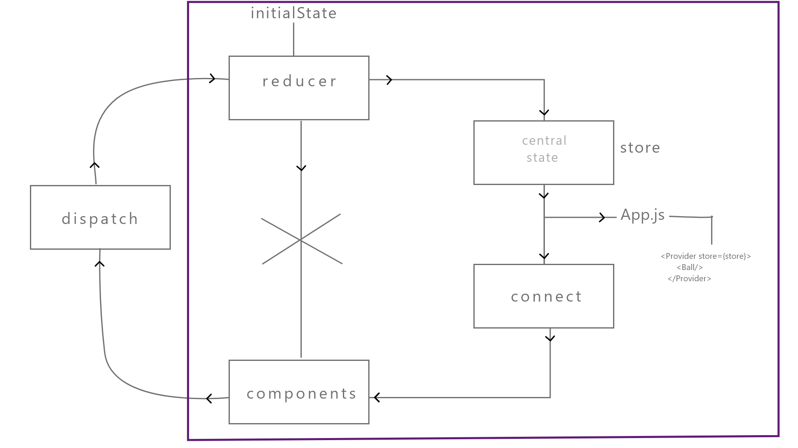
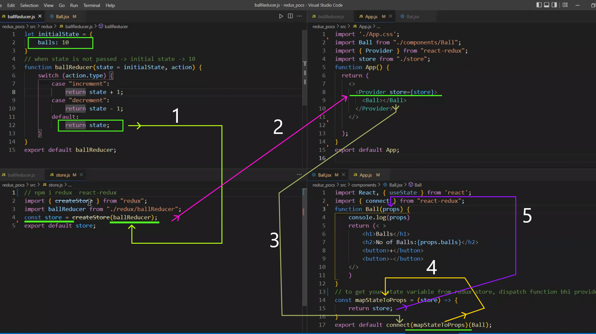
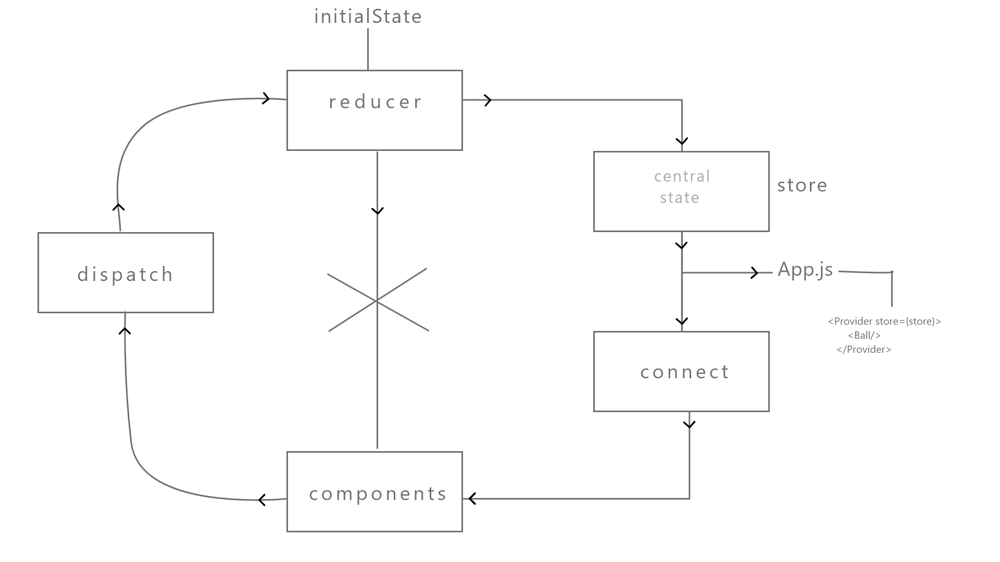

## First solve with "useState" then "useReducer" then "Reducer"
------------------
### steps :
##### 1- counterBallWithUseState
##### 2- counterBallWithUseReducer
##### 3- sellBuyBatUseState
##### 4- sellBuyBatUseReducer
##### 5- In Redux -> reduxwithball
##### 6-
##### 7-

----------------------------------------
---------------------------------------
---------------------------------------

## compair between "useState" & "useReducer" Hooks

### useState :

      const [state,setState] = useState("initialState")
-----------------------

      import React,{useState} from 'react'

      function Ball() {
        const [balls,setBalls] = useState(10)

        let  increment = ()=>{
                setCounter(balls + 1)
         }

        let  decrement = ()=>{
            if(balls>0)
                setCounter(balls -1)
        }

        return (
        
            <>
            <h1>balls</h1>
            <h1>no of balls:{balls}</h1>
            <button onClick={increment}>+</button>
            <button onClick={decrement}>-</button>
            </>
        )
        }

        export default Ball


### useReducer :
   
     const [state, dispatch] = useReducer(reducer, initialState);


- (reducer, initialState) :

     - initialState => balls:10
    
    - useReducer , "initial state" ke sath sath "reducer function" bhi leta hai.
    - reducer() function as a parameter "state", "action" leta hai.
      
            function reducer(state,action){
                switch(action.type){
                    case 'increment':
                        return state+1;

                    case 'decrement':
                        return state-1; 
                    
                    default:
                        console.log("wrong type") ;   
                }
            }

    

- [state, dispatch] :
   
   - increment , decrement => enn dono k liye useReducer ek common function dega "dispatch()" nam se.
   - dispatch me value pass karte hai with the help of "payload"
        
          <input type={'number'}  value={state.value} 
            onChange={(e)=>{
                let typeValue = e.target.value; 
                dispatch({ type:'set_value' , payload:typeValue }) // dispatch me value pass kiye with the help of "payload"
                }}   
           />

       -----------------            


             return (
                <>
                <h1>balls</h1>
                <h1>no of balls:{state}</h1>
                <button onClick={()=>{
                    dispatch({type:'increment'})
                }}>+</button>
                <button onClick={()=>{
                    dispatch({type:'decrement'})
                }}>-</button>
             </>
            )


- eg => 

            import React,{useReducer} from 'react'

            function reducer(state,action){
                switch(action.type){
                    case 'increment':
                        return state+1;

                    case 'decrement':
                        return state-1; 
                    
                    default:
                        console.log("wrong type") ;   
                }
            }


            function Ball() {
                
               const [state,dispatch] = useReducer(reducer,10)

            return (
                <>
                <h1>balls</h1>
                <h1>no of balls:{state}</h1>
                <button onClick={()=>{
                    dispatch({type:'increment'})
                }}>+</button>
                <button onClick={()=>{
                    dispatch({type:'decrement'})
                }}>-</button>
            </>
            )
            }

            export default Ball


## In sellBuyBatUseReducer :

```js   
       //reducer function Hints :

        function reducer(state,action){  
               
                switch(action.type){
                      
                      case 'sell_bat':
                           break;
                       
                      case 'buy_bat':
                           break;
                          
                      case 'set_value':
                                             
                           break;                          
                }
        }


```

```js

       import React,{useReducer} from 'react'
        
        let initialState = {
            bat:10,
            value:''   // tosell ko as a "value" liye h 
        }

        function reducer(state,action){   // dispatch related to action , dispatch passes obj , in obj -> action form
            switch(action.type){
                case 'sell_bat':
                    if(state.bat - state.value <0){  // handle krr rha ki buy karne prr -ve me na jaye 
                        return {
                            ...state,                // state me initialState pass hua h
                            value:''
                        }
                    }
                    return{
                        bat:state.bat - state.value,
                        value:''                      // input me jo value type kiye h as a "tosell" usseee-> , input se hataye h 
                    }
                break;
                
                case 'buy_bat':
                    return{
                        bat:state.bat + Number(state.value),
                        value:''
                    }
                break;

                case 'set_value':
                    return{
                        bat:state.bat,
                        value:action.payload     // jo dispatch se object pass karte h use "action" bolte h 
                    }                           //  dispatch se  [type='set_value'] & [payload] pass huaa h toh action se hi access karte h ..  i.e action.payload
                break;                          
            }
        }


        function Bat() {
        const [state,dispatch] = useReducer(reducer,initialState)

        return (
            <>
            <h1>Bat</h1>
            <h1>no of bats:{state.bat}</h1> 
            <input type={'number'}  value={state.value} 
                onChange={(e)=>{
                    let typeValue = e.target.value; 
                    dispatch({ type:'set_value' , payload:typeValue }) // dispatch me value pass kiye with the help of "payload"
                }}                                                    // payload se data pass krr rhe h , matlab action form ho rha 
            />
            <button onClick={()=>{dispatch({type:'sell_bat'})}}>sell</button>
            <button onClick={()=>{dispatch({type:'buy_bat'})}}>buy</button>
            </>
        )
        }

        export default Bat

```


# Redux :
#### npm i redux react-redux
- Reducer
- initialState
- dispatch
- action
- type
- payload


#### Reducer :
- It contains all the state manipulation logic.
  [state change karta hai]

#### initialState :
- your state , when your app initially renders.

#### dispatch :
- It is a function that is used to pass "action" object to reducer.

#### action :
- It is an object send by dispatch to reducer function.
- It contain two properties :
   
   -  type 
   -  payload : ( dispatch me "value" pass karte hai with the help of payload. )
------  
##### Do you learn to Redux after doing these three things.( agar aap ye teen chije krr lete ho toh aap redux sikh jate ho ) :
- state change
- user-Input
- some req / Db query  [async task k sath]
---------  

-------------
### Redux => reduxwithball :
--------------
- esme dispatch ko samil nhi kiye hai :
  



- initialState => reducer => store => connect [component(Ball) and store(mapStateToProps) ko connect karta hai]

- provider : ( In App.js me )
  
  - redux ko apane app se connect kiya
  - ess provider k through hmm apni app ko redux ke sath connect kar sakte hai.
   - install & import  react-redux for Provider -> npm i react-redux
  - import { Provider } from 'react-redux';  
- store :
  
  - ess provider ko pata hi nhi hamara "state" kaha hai, kaun se "store" me hai ,
  - eske pas koi information nahi hai , toh information k liye hme "store" ko import karna pda.
  - ess "store" ko as a "props" pass kar degen "Provider" ko 
  
         
         import { Provider } from 'react-redux'; 

         <Provider store={store}>
           <Ball/>
         </Provider>

- connect :
    
  - to connect your "store" with a "components".
  - agar ye ball components ko store se bat karani hai, toh hamare pas ek function hota hai "connect"
  - export default connect(mapStateToProps)(Ball);
 
  -  "store"  -> mapsstatetoprops
     
     
           
           function Ball(props) {
                console.log(props)
                return (<>
                    <h1>Balls</h1>
                    <h2>No of Balls:{props.balls}</h2>
                    <button>+</button>
                    <button>-</button>
                </>
                )
            }


            
            
            // to get your state variable from redux store , (dispatch function bhi provide karta h) 
           
            const mapStateToProps = (store) => {   // return state-variable as props
                return store;  // this fun return state...variable as a props in our Ball component.
                        
            }


            export default connect(mapStateToProps, mapDispatchtoProps)(Ball);
      
     



- connect :
    
  - to connect your "store" with a "components".
  - agar ye ball components ko store se bat karani hai, toh hamare pas ek function hota hai "connect"
  - export default connect(mapStateToProps, mapDispatchtoProps)(Ball);
  - to give access to the component to two things
     - first -> "store"  -> mapsstatetoprops
     
     
            // to get your state variable from redux store , (dispatch function bhi provide karta h) 
           
            const mapStateToProps = (store) => {   // return state-variable as props
                return store;  // this fun return state...variable as a props in our Ball fun.
                        
            }


            function Ball(props) {
                console.log(props)
                return (<>
                    <h1>Balls</h1>
                    <h2>No of Balls:{props.balls}</h2>
                    <button>+</button>
                    <button>-</button>
                </>
                )
            }
      
     - second  -> "dispatch" -> mapdispatchtoprops

            // dispatcher solve - fun pass[setbal,buyball] as a props 
          
            const mapDispatchtoProps = (dispatch) => {      // return function as props
                return {                                   
                    sellBall: () => {           //HINT ::=> sellBall:dispatch({})   -> [click karne prr call ho] ->  sellBall:()=>{dispatch({})} 
                        dispatch({                     
                            type: "decrement"
                        })
                    },
                    buyBall: () => {
                        dispatch({
                            type: "increment"
                        })
                    }
                }
            }
